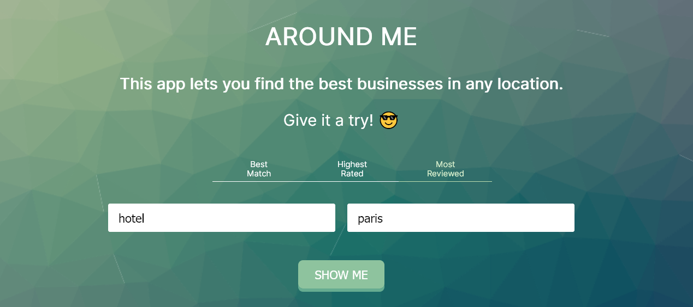

<h1 align="center">
  Around Me
</h1> 

<p align="center">
 A React app that uses the Yelp API to find interesting things to do in a certain location.</a>  
</p>




# 👩‍💻 [Demo](https://around-me.vercel.app/)

# 🛠 Built With

* [React JS](https://reactjs.org)

# 👷‍♀️ Installation & Set Up

### Prerequisites

You need to install [Node.js](https://nodejs.org/en/download/). Then you may choose between:

* npm 
  ```sh
  npm i npm@latest -g
  ```
  or...

* yarn
  ```sh
  npm i -g yarn
  ```
  
### Installation

1. Get an API Key at [Yelp's developers website](https://www.yelp.com/developers/documentation/v3)
2. Clone the repo
   ```sh
   git clone https://github.com/voirs/around-me.git
   ```
3. Move to the directory
   ```sh
   cd around-me
   ```
4. Install packages
   ```sh
   yarn | npm install
   ```
5. Create a file called .env.local similar to .env.example and enter your API Key
   ```sh
   REACT_APP_API_KEY= 'ENTER YOUR APIKEY'
   ```
6. Run the following command in root folder to start the application in a development environment
   ```sh
   yarn start | npm run start
   ```
   
# :bug: Issues

Feel free to **file a new issue** with a respective title and description. If you already found a solution to your problem, **I would love to review your pull request**!

<!-- CONTRIBUTING -->
# 🤝 Contributing

Contributions are what make the open source community such an amazing place to be learn, inspire, and create. Any contributions you make are **greatly appreciated**.

1. Fork the Project
2. Create your Feature Branch (`git checkout -b feature/AmazingFeature`)
3. Commit your Changes (`git commit -m 'Add some AmazingFeature'`)
4. Push to the Branch (`git push origin feature/AmazingFeature`)
5. Open a Pull Request


<!-- LICENSE -->
# 📘 License

Distributed under the MIT License. See `LICENSE` for more information.


<!-- CONTACT -->
# ✉️ Contact

Daniela Giorgio - [@web](https://danielagiorgio.com)

